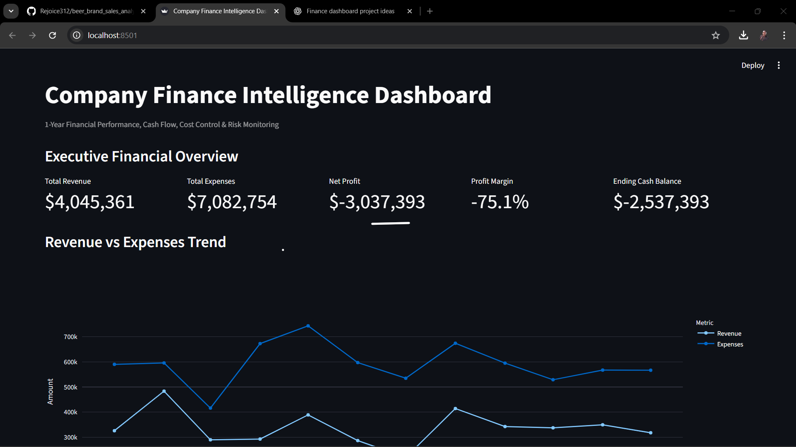
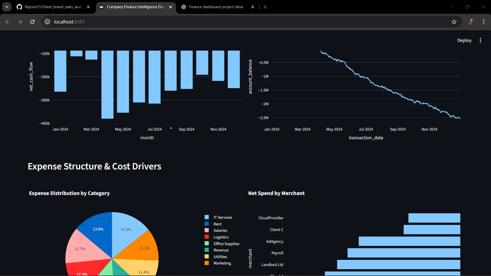

# Company Finance Intelligence Dashboard (1-Year Analysis)

An executive-ready **Finance Analytics Dashboard** built to monitor **financial health, cash flow, cost control, budget performance, and risk signals** across a company’s operations over a one-year period.

This project simulates the kind of **decision-support dashboards used by CFOs, FP&A teams, and finance leaders** to track performance, manage risk, and improve profitability.

**Live Dashboard:**  
https://your-streamlit-app-link.streamlit.app

---

## Dashboard Preview

> *Images are screenshots from the live Streamlit dashboard.*

---

## Project Overview

This dashboard answers real business questions such as:

- Is the company financially healthy?
- Are expenses growing faster than revenue?
- Which cost categories and vendors drive the most spend?
- Are we meeting revenue, expense, and profit targets?
- Are there early warning signs of financial risk?

The goal is not just visualization — but **actionable financial insight**.

---

## Key Finance KPIs Tracked

### Executive & Financial Health
- Total Revenue (YTD)
- Total Expenses (YTD)
- Net Profit
- Profit Margin
- Ending Cash Balance
- Monthly Revenue & Expense Trends

### Cash Flow & Liquidity
- Monthly Net Cash Flow
- Cash Inflows vs Outflows
- Account Balance Trend
- Burn Rate Indicators

### Cost Control & Efficiency
- Expense Breakdown by Category
- Fixed vs Variable Costs
- Top Cost Drivers
- Cost-to-Revenue Ratio

### Budget & Target Performance
- Actual vs Budgeted Revenue
- Expense Limit Tracking
- Profit Target Achievement
- Monthly Variance Analysis

### Risk & Spend Monitoring
- High-Risk and Recurring Vendors
- Concentrated Spend Exposure
- Overspending Signals

---

## Data Structure

The project uses a **multi-sheet Excel dataset** representing one year of company operations:

- **transactions** – Daily income & expense transactions with running balance
- **categories** – Expense classification (fixed, variable, essential)
- **monthly_targets** – Revenue, expense, and profit targets
- **merchant_rules** – Recurring vendors and risk flags

This mirrors how finance data is commonly modeled in real organizations.

---

## Tech Stack

- **Python**
- **Pandas & NumPy**
- **Plotly**
- **Streamlit**
- **Excel (multi-sheet data modeling)**
- **Git (Version Control)**

---

## Why This Project Matters

This dashboard demonstrates:

✔ Financial reasoning, not just plotting  
✔ Understanding of cash flow, profitability, and risk  
✔ Ability to translate raw transactions into executive insight  
✔ Real-world FP&A and finance analytics thinking  

This is the type of dashboard used in:
- Corporate Finance
- FP&A
- Fintech & Banking
- Business Intelligence teams

---
